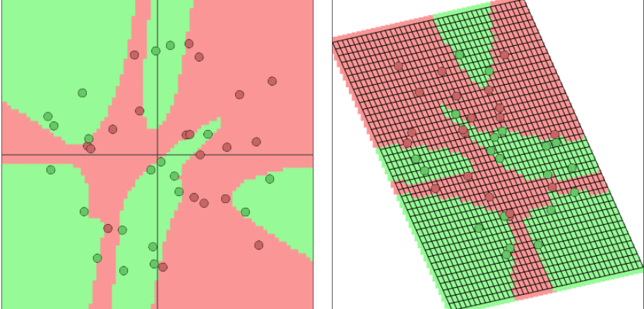
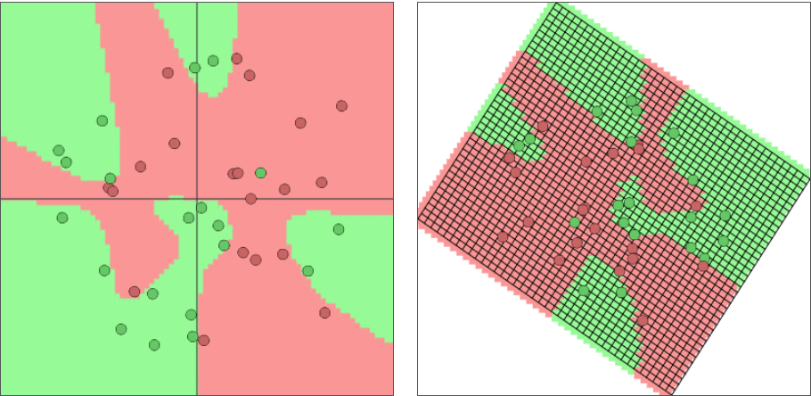
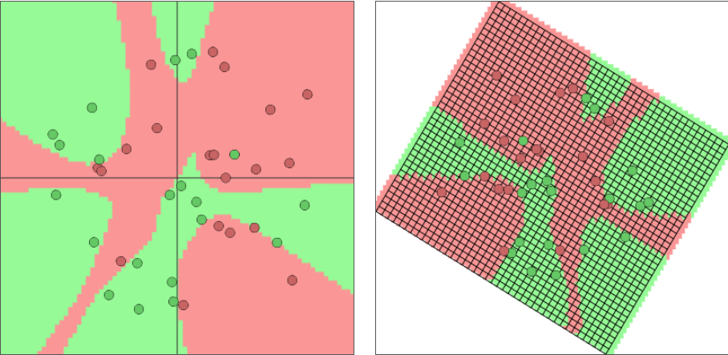
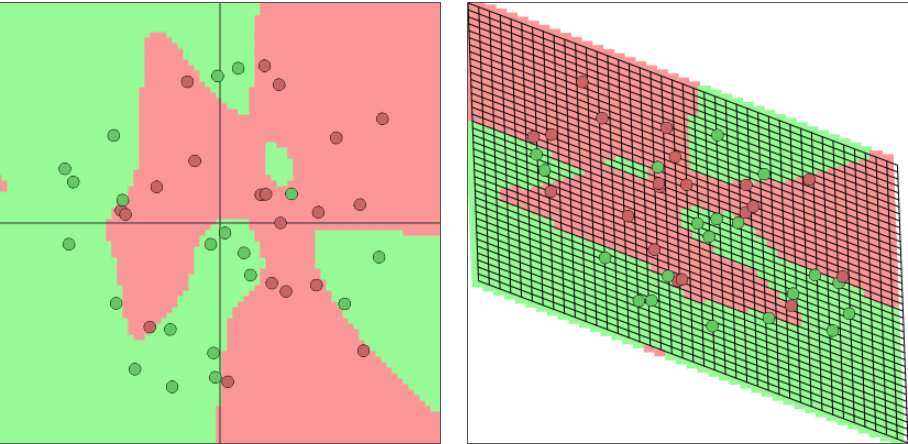
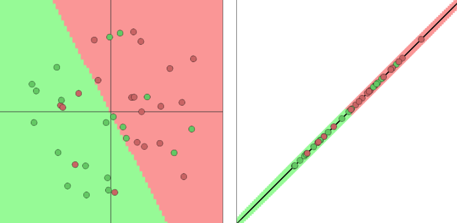

# 可视化正则化参数 lambda 对决策边界的影响

* 斯坦福 cs231n 课程组大牛`karpath`的杰作：[toy 2d classfication with 2-layer neural network](https://cs.stanford.edu/people/karpathy/convnetjs/demo/classify2d.html )

本实验中一些参数：
* network layers:`2`
* layer1 neurons:`6`
* layer2 neurons:`2`
* activation function:`tanh`
* model:`softmax`
* learning_rate:`0.01`

下面看下不同的正则化参数`lambda`对于二分类问题中决策边界的影响。

1. `lambda = 0`  

可以看到如果没有加入任何正则化，那么训练得到的决策边界将会非常复杂，所有的样本点均分类正确，出现严重的过拟合。

2. `lambda = 0.0001` 

可以从图中看到，加入一部分正则化后，存在一个绿色点被错误分类，但是整个决策边界仍然很复杂，说明正则化程度还不够，模型依然很复杂。

3. `lambda = 0.001`

决策边界仍然很负责，但是较之前的，已经比较圆滑。

4. `lambda = 0.1`

决策边界已经基本连接成片了，不再像之前那样非常分散；并且在红色部分中间出现了一块单独的绿色区域。

5. `lambda = 1`

这种情况下正则化太过于严重，导致模型已经`欠拟合`。